# IssueFlow Agent

面向 GitHub 仓库维护场景的 Issue 智能分诊与人工审核系统。

IssueFlow 通过 GitHub Webhook 接收 Issue 事件，使用 LangGraph 编排大模型分析流程，生成分类、风险判断、复现信息检查、标签和回复草案。模型不会直接修改 GitHub，所有写操作都必须先进入人工审核，批准后再由 RQ Worker 异步执行。

> 当前状态：核心 MVP 已完成，并已在真实 GitHub Issue 上跑通
> 项目类型：工作流型 Agent / Agent 应用后端
> 核心原则：模型负责提出建议，程序负责约束流程，人工负责批准外部操作

---

## 目录

- [项目背景](#项目背景)
- [已实现功能](#已实现功能)
- [总体架构](#总体架构)
- [部署架构](#部署架构)
- [Webhook 接入流程](#webhook-接入流程)
- [Agent 工作流](#agent-工作流)
- [人工审核与 GitHub 写回](#人工审核与-github-写回)
- [数据模型](#数据模型)
- [状态流转](#状态流转)
- [安全边界](#安全边界)
- [技术栈](#技术栈)
- [项目结构](#项目结构)
- [本地运行](#本地运行)
- [配置 GitHub Webhook](#配置-github-webhook)
- [使用方式](#使用方式)
- [API 说明](#api-说明)
- [设计说明](#设计说明)
- [真实演示](#真实演示)
- [当前边界](#当前边界)
- [Roadmap](#roadmap)

---

## 项目背景

GitHub 仓库中的 Issue 通常需要维护者手工完成以下工作：

- 判断 Issue 属于 Bug、功能建议、文档问题还是普通咨询；
- 判断优先级和潜在安全风险；
- 检查是否缺少运行环境、版本、复现步骤和错误日志；
- 编写补充信息回复；
- 添加标签；
- 决定是否允许自动化系统执行写操作。

直接让大模型修改 GitHub 存在明显风险：

- 模型输出具有不确定性；
- Issue 正文属于外部不可信输入；
- 模型可能生成错误标签或不合适的公开回复；
- 安全漏洞不适合自动公开处理；
- 外部 API 调用需要权限、状态和失败记录。

IssueFlow 将整个过程拆分为：

```text
事件接入
→ Agent 分析
→ 生成命令草案
→ 人工审核
→ 异步写回 GitHub
→ 保存执行结果
```

系统不会让模型直接调用 GitHub API，而是先将模型建议转换为受约束的命令草案。

---

## 已实现功能

| 模块 | 当前能力 |
|---|---|
| GitHub Webhook | 接收真实 `issues` 事件 |
| Webhook 安全 | HMAC-SHA256 签名校验 |
| 事件去重 | 基于 `X-GitHub-Delivery` 唯一约束 |
| 事件持久化 | 保存原始投递和标准化 Issue 事件 |
| 异步执行 | Redis + RQ Worker |
| Agent 编排 | LangGraph `StateGraph` |
| 结构化输出 | Pydantic Schema |
| Issue 分诊 | 类型、优先级、风险、置信度 |
| 复现检查 | 检查运行环境、版本、步骤、结果和日志 |
| 风险分流 | 高风险 Issue 进入安全审核分支 |
| 命令草案 | `add_label`、`post_comment` |
| 人工审核 | approve / reject |
| 并发控制 | `SELECT FOR UPDATE` 防止重复审核 |
| GitHub 写回 | 添加标签、发布评论 |
| 状态记录 | pending、running、approved、executing、executed、failed |
| 最小权限 | Fine-grained PAT，仅授权指定仓库的 Issues 写权限 |

---

## 总体架构

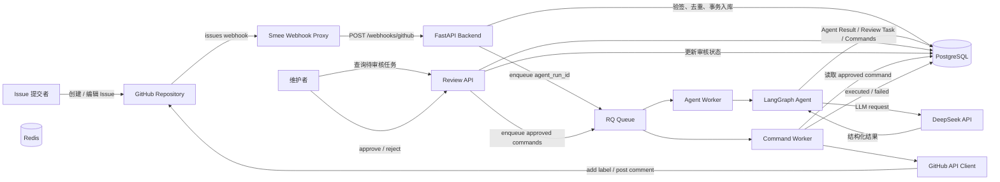

### 架构职责

| 组件 | 职责 |
|---|---|
| FastAPI Backend | 接收 Webhook、提供查询和审核 API |
| PostgreSQL | 保存业务事实、状态和错误信息 |
| Redis | 为 RQ 提供队列和任务调度能力 |
| Agent Worker | 执行大模型分析 |
| LangGraph | 编排分类、风险判断和回复生成流程 |
| Review API | 查询、批准或拒绝命令草案 |
| Command Worker | 执行批准后的 GitHub 写操作 |
| GitHub API Client | 封装标签与评论接口 |
| DeepSeek | 提供 Issue 分析所需的大模型能力 |

---

## 部署架构

当前项目通过 Docker Compose 在本地运行。

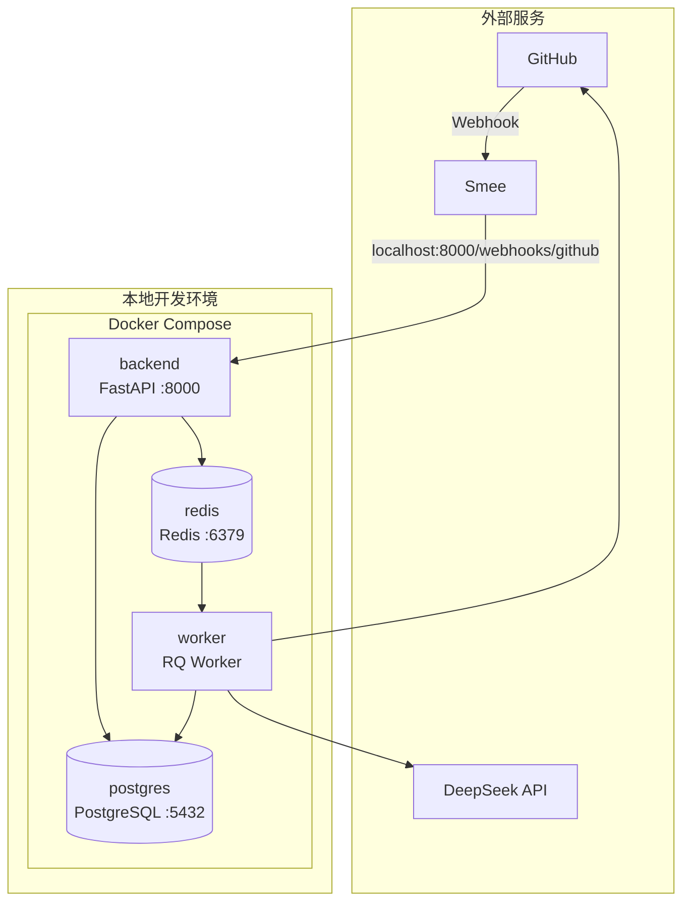

### 数据职责

```text
PostgreSQL
= 业务事实来源

Redis
= 队列和任务调度

GitHub
= 外部 Issue 状态

DeepSeek
= 模型推理服务
```

即使 Redis 中的任务数据丢失，已经入库的 Issue、Agent Run、审核任务和命令仍然保存在 PostgreSQL 中。

---

## Webhook 接入流程

### Webhook 时序图

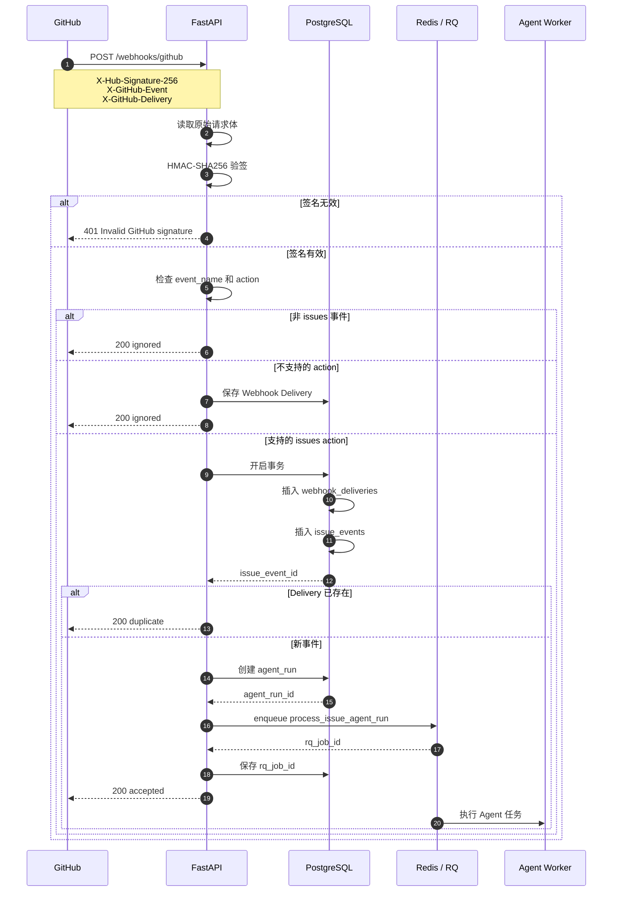

### 当前支持的 GitHub action

```text
opened
edited
closed
reopened
```

不支持的 action 会保存原始 Webhook，但不会创建 Issue Event 或触发 Agent。

### Webhook 去重

系统使用：

```text
X-GitHub-Delivery
```

作为 Webhook Delivery 唯一标识。

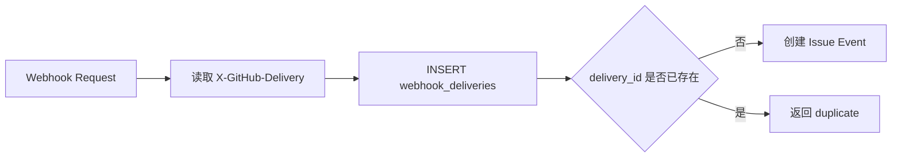

---

## Agent 工作流

当前 Agent 是预定义流程的工作流型 Agent。

模型负责分析和生成结构化结果，程序负责规定节点、分支和允许执行的动作。

### LangGraph 节点图

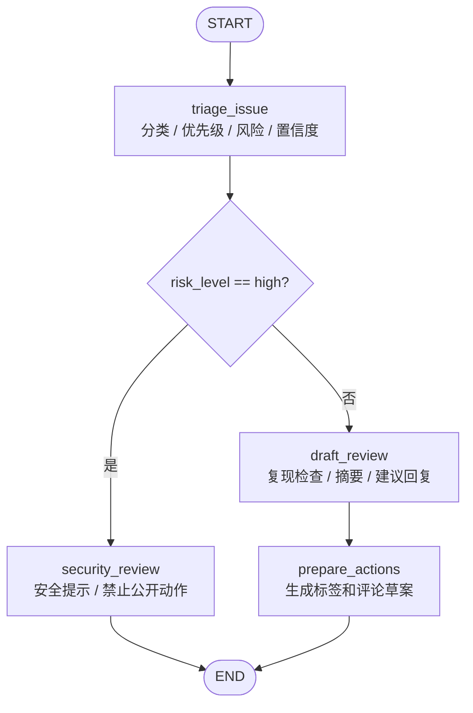

### Agent 状态

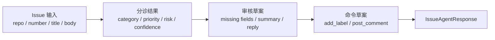

### 分类结果

```text
bug
feature
question
documentation
other
```

### GitHub 标签映射

```text
bug           → bug
feature       → enhancement
question      → question
documentation → documentation
other         → 不自动添加标签
```

`other` 不会被强行映射成 `invalid`，因为“无法归类”不等于“无效 Issue”。

### 高风险处理

当内容涉及以下情况时，Agent 将 `risk_level` 设置为 `high`：

- 漏洞利用；
- 认证绕过；
- 密钥泄露；
- 隐私数据；
- 危险执行操作。

高风险分支：

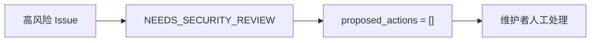

高风险 Issue 不会自动生成公开标签或评论命令。

---

## 人工审核与 GitHub 写回

### 审核与执行时序图

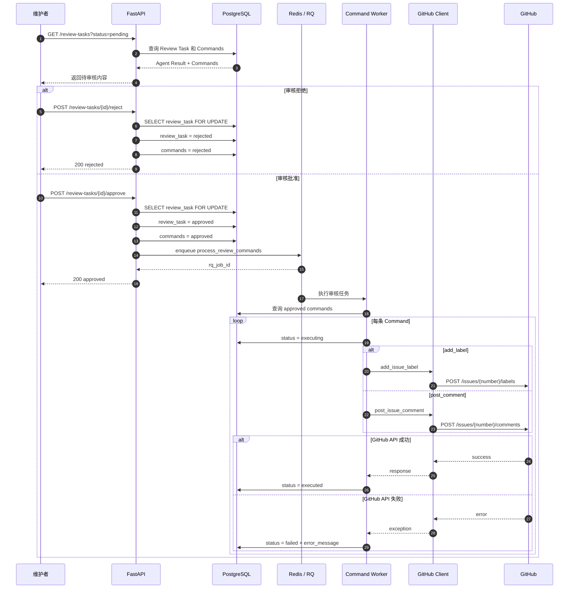

### 为什么需要人工审核

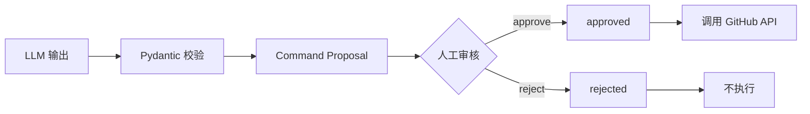

模型只能生成两种命令：

```text
add_label
post_comment
```

模型不能：

- 关闭 Issue；
- 删除评论；
- 修改仓库代码；
- 创建 Pull Request；
- 执行 Issue 中提供的脚本；
- 绕过人工审核直接访问 GitHub。

---

## 数据模型

### ER 图

```mermaid
erDiagram
    WEBHOOK_DELIVERIES ||--o| ISSUE_EVENTS : creates
    ISSUE_EVENTS ||--o| AGENT_RUNS : triggers
    AGENT_RUNS ||--o| REVIEW_TASKS : creates
    REVIEW_TASKS ||--o{ GITHUB_COMMANDS : contains

    WEBHOOK_DELIVERIES {
        int id PK
        string delivery_id UK
        string event_name
        jsonb raw_payload
        timestamptz created_at
    }

    ISSUE_EVENTS {
        int id PK
        int webhook_delivery_id FK
        string source
        string event_type
        string repo
        string action
        int issue_number
        string issue_title
        text issue_body
        timestamptz created_at
    }

    AGENT_RUNS {
        int id PK
        int issue_event_id FK_UK
        string status
        string rq_job_id
        jsonb result_json
        timestamptz started_at
        timestamptz finished_at
        text error_message
        timestamptz created_at
    }

    REVIEW_TASKS {
        int id PK
        int agent_run_id FK_UK
        string status
        string reviewer
        text review_note
        timestamptz created_at
        timestamptz reviewed_at
    }

    GITHUB_COMMANDS {
        int id PK
        int review_task_id FK
        string command_type
        jsonb payload
        string status
        string idempotency_key UK
        text error_message
        timestamptz created_at
        timestamptz updated_at
        timestamptz executed_at
    }
```

### 数据表职责

| 数据表 | 职责 |
|---|---|
| `webhook_deliveries` | 保存 GitHub Delivery ID 和原始请求 |
| `issue_events` | 保存标准化 Issue 事件 |
| `agent_runs` | 保存 Agent 任务状态和结构化结果 |
| `review_tasks` | 保存人工审核状态、审核人和备注 |
| `github_commands` | 保存标签、评论命令及执行结果 |

---

## 状态流转

### Agent Run

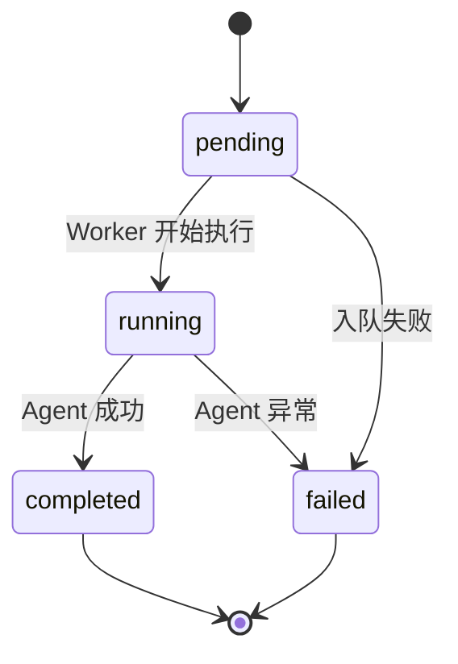

### Review Task

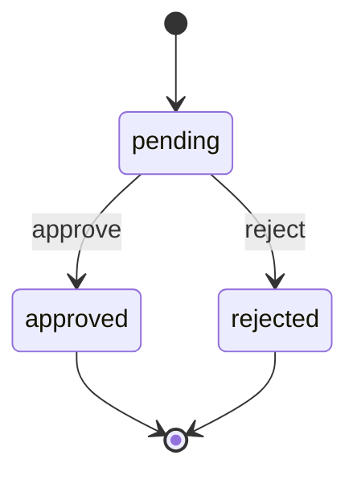

重复批准或拒绝已经完成的审核任务，会返回：

```text
409 Conflict
```

### GitHub Command

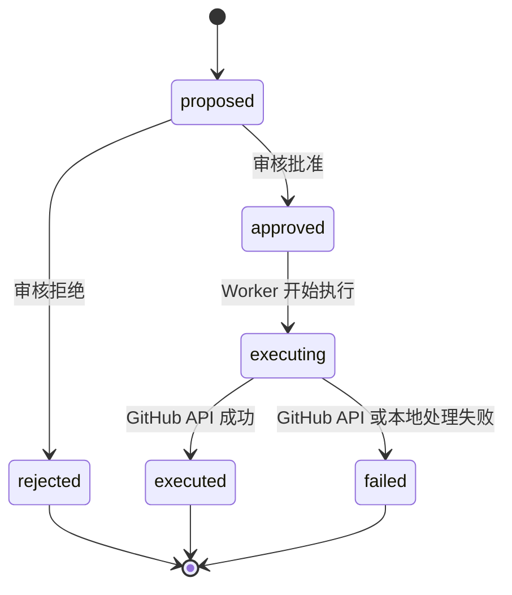

---

## 安全边界

### 信任边界图

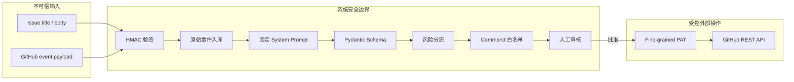

### 当前安全措施

| 风险 | 当前措施 |
|---|---|
| 伪造 Webhook | HMAC-SHA256 验签 |
| Webhook 重放 | `X-GitHub-Delivery` 唯一约束 |
| 非目标事件触发 | `event_name` 和 `action` 白名单 |
| Prompt Injection | System Prompt 明确禁止执行 Issue 中的指令 |
| 模型自由输出 | Pydantic 结构化输出 |
| 模型越权 | 只允许 `add_label` 和 `post_comment` |
| 高风险内容公开 | 高风险分支不生成公开命令 |
| 未审核自动写入 | Human-in-the-loop |
| GitHub Token 权限过大 | Fine-grained PAT，仅授权单仓库 Issues 权限 |
| 重复审核 | `SELECT FOR UPDATE` |
| 重复创建命令 | 唯一 `idempotency_key` |

### 当前幂等边界

现有唯一约束可以避免：

- 同一 Delivery 重复入库；
- 同一 Issue Event 重复创建 Agent Run；
- 同一 Agent 输出重复创建 Command 记录；
- 同一审核任务被并发重复决定。

当前版本尚未严格保证 GitHub 外部操作在所有崩溃窗口下只执行一次。

例如：

```text
GitHub 评论发布成功
→ Worker 在更新数据库前崩溃
→ 数据库仍显示 executing
→ 后续恢复可能再次发布评论
```

外部操作对账和命令恢复属于后续增强。

---

## 技术栈

| 类型 | 技术 |
|---|---|
| 开发语言 | Python 3.12 |
| Web 框架 | FastAPI、Uvicorn |
| Agent 编排 | LangGraph |
| 模型调用 | LangChain OpenAI Compatible API |
| 模型服务 | DeepSeek |
| 数据校验 | Pydantic |
| 数据库 | PostgreSQL、Psycopg |
| 缓存与队列 | Redis、RQ |
| 外部集成 | GitHub Webhook、GitHub REST API |
| 容器化 | Docker、Docker Compose |
| 本地 Webhook 转发 | Smee |

---

## 项目结构

```text
issueflow-agent/
├── backend/
│   ├── Dockerfile
│   ├── requirements.txt
│   └── app/
│       ├── __init__.py
│       ├── main.py
│       ├── agent.py
│       ├── github_webhook.py
│       ├── github_client.py
│       ├── job_queue.py
│       └── tasks.py
│
├── database/
│   └── init/
│       ├── 001_create_issue_events.sql
│       ├── 002_create_webhook_deliveries.sql
│       ├── 003_link_issue_events_to_webhook_deliveries.sql
│       ├── 004_create_agent_runs.sql
│       ├── 005_create_review_tasks.sql
│       └── 006_create_github_commands.sql
│
├── .env.example
├── .gitignore
├── docker-compose.yml
└── README.md
```

### 核心文件职责

| 文件 | 职责 |
|---|---|
| `main.py` | FastAPI 路由、Webhook 接入、查询和审核接口 |
| `agent.py` | LangGraph 状态、节点、路由和结构化输出 |
| `github_webhook.py` | GitHub HMAC 签名校验 |
| `github_client.py` | GitHub 标签与评论 API 封装 |
| `job_queue.py` | Redis/RQ 队列连接和任务入队 |
| `tasks.py` | Agent 分析任务和 GitHub Command 执行任务 |
| `database/init` | PostgreSQL 初始化脚本 |

---

## 本地运行

### 1. 环境要求

- Docker
- Docker Compose
- Git
- Node.js / npm
- 可用的大模型 API
- 一个用于测试的 GitHub 仓库
- GitHub Fine-grained Personal Access Token

### 2. 克隆项目

```bash
git clone https://github.com/chengyebi/issueflow-agent.git
cd issueflow-agent
```

### 3. 配置环境变量

```bash
cp .env.example .env
```

编辑 `.env`：

```env
GITHUB_WEBHOOK_SECRET=replace-with-your-webhook-secret

LLM_API_KEY=replace-with-your-llm-api-key
LLM_BASE_URL=https://api.deepseek.com
CHAT_MODEL=deepseek-v4-flash

GITHUB_TOKEN=replace-with-your-github-token
```

不要将真实密钥提交到 Git。

`.env` 应当被 `.gitignore` 忽略。

检查：

```bash
git check-ignore -v .env
```

### 4. GitHub Token 权限

建议创建 Fine-grained Personal Access Token。

```text
Repository access:
Only select repositories

Selected repository:
issueflow-agent

Repository permissions:
Issues → Read and write
```

不需要授予：

```text
Contents Write
Actions Write
Administration
```

### 5. 启动服务

```bash
docker compose up -d --build
```

检查容器：

```bash
docker compose ps
```

预期包含：

```text
backend
worker
postgres
redis
```

### 6. 健康检查

```bash
curl --noproxy '*' \
  http://127.0.0.1:8000/health
```

预期：

```json
{
  "status": "ok"
}
```

### 7. 查看 Worker 日志

```bash
docker compose logs -f worker
```

Worker 正常启动时会显示：

```text
*** Listening on issueflow...
```

### 8. 验证 GitHub Token 已进入 Worker

```bash
docker compose exec worker \
  sh -lc 'test -n "$GITHUB_TOKEN" && echo GITHUB_TOKEN_LOADED'
```

预期：

```text
GITHUB_TOKEN_LOADED
```

### 数据库初始化说明

`database/init` 下的 SQL 会在 PostgreSQL 创建新数据卷时自动执行。

如果数据库卷已经存在，新增 SQL 文件不会自动执行，需要手工应用对应脚本。

例如：

```bash
docker compose exec -T postgres \
  psql -U postgres -d issueflow \
  -f /docker-entrypoint-initdb.d/005_create_review_tasks.sql
```

```bash
docker compose exec -T postgres \
  psql -U postgres -d issueflow \
  -f /docker-entrypoint-initdb.d/006_create_github_commands.sql
```

仅在确认不需要保留本地数据时，才删除数据卷重新初始化：

```bash
docker compose down -v
docker compose up -d --build
```

---

## 配置 GitHub Webhook

### 1. 创建 Smee Channel

打开：

```text
https://smee.io/
```

创建一个 Channel，并保存 Channel URL。

不要将真实 Smee Channel URL 提交到仓库。

### 2. 安装 Smee Client

```bash
npm install -g smee-client
```

### 3. 启动转发

```bash
smee \
  -u https://smee.io/<YOUR_CHANNEL_ID> \
  -t http://127.0.0.1:8000/webhooks/github
```

成功后终端会显示：

```text
Connected to https://smee.io/<YOUR_CHANNEL_ID>
Forwarding to http://127.0.0.1:8000/webhooks/github
```

### 4. 配置 GitHub Webhook

进入测试仓库：

```text
Settings
→ Webhooks
→ Add webhook
```

填写：

```text
Payload URL:
https://smee.io/<YOUR_CHANNEL_ID>

Content type:
application/json

Secret:
与 GITHUB_WEBHOOK_SECRET 完全相同

Events:
Let me select individual events
→ Issues
```

创建或编辑 Issue 后，Smee 终端应显示：

```text
POST http://127.0.0.1:8000/webhooks/github - 200
```

---

## 使用方式

### 1. 查询最近的 Issue 事件

```bash
curl --noproxy '*' \
  http://127.0.0.1:8000/events
```

### 2. 直接测试 Agent 分析

```bash
curl --noproxy '*' \
  -X POST \
  http://127.0.0.1:8000/agent/analyze \
  -H 'Content-Type: application/json' \
  -d '{
    "repo": "chengyebi/issueflow-agent",
    "issue_number": 1001,
    "title": "登录接口返回 500",
    "body": "输入错误密码后，接口返回 500。"
  }'
```

### 3. 查询待审核任务

```bash
curl --noproxy '*' \
  'http://127.0.0.1:8000/review-tasks?status=pending'
```

返回内容包括：

- Agent 分类；
- 优先级；
- 风险等级；
- 置信度；
- 缺失复现字段；
- 摘要；
- 建议回复；
- 标签和评论命令草案；
- `review_task_id`。

### 4. 批准任务

```bash
curl --noproxy '*' \
  -X POST \
  'http://127.0.0.1:8000/review-tasks/<REVIEW_TASK_ID>/approve' \
  -H 'Content-Type: application/json' \
  -d '{
    "reviewer": "cy",
    "review_note": "确认 Agent 分析结果，允许写回 GitHub"
  }'
```

批准后：

```text
review_task = approved
commands = approved
→ RQ 入队
→ Worker 执行
→ GitHub 添加标签 / 发布评论
→ commands = executed
```

### 5. 拒绝任务

```bash
curl --noproxy '*' \
  -X POST \
  'http://127.0.0.1:8000/review-tasks/<REVIEW_TASK_ID>/reject' \
  -H 'Content-Type: application/json' \
  -d '{
    "reviewer": "cy",
    "review_note": "分析结果不合适，不执行 GitHub 操作"
  }'
```

拒绝后：

```text
review_task = rejected
commands = rejected
```

对应命令不会进入执行队列。

### 6. 查询已批准或已拒绝任务

```bash
curl --noproxy '*' \
  'http://127.0.0.1:8000/review-tasks?status=approved'
```

```bash
curl --noproxy '*' \
  'http://127.0.0.1:8000/review-tasks?status=rejected'
```

---

## API 说明

| 方法 | 路径 | 说明 |
|---|---|---|
| `GET` | `/health` | 健康检查 |
| `GET` | `/events` | 查询最近的 Issue 事件 |
| `POST` | `/issues` | 基础 Issue 请求模型测试 |
| `POST` | `/dev/events/github` | 本地模拟 GitHub Issue 事件 |
| `POST` | `/webhooks/github` | 接收真实 GitHub Webhook |
| `POST` | `/agent/analyze` | 直接调用 Agent 分析 |
| `GET` | `/review-tasks` | 查询审核任务 |
| `POST` | `/review-tasks/{id}/approve` | 批准任务 |
| `POST` | `/review-tasks/{id}/reject` | 拒绝任务 |

### 查询审核任务参数

```text
status=pending
status=approved
status=rejected
```

非法状态会返回：

```text
400 Invalid review status
```

重复决定同一个审核任务会返回：

```text
409 Review task has already been decided
```

---

## 设计说明

### 为什么 Webhook 不直接调用大模型

LLM 和 GitHub API 都属于耗时、可能失败的外部服务。

如果 Webhook 同步执行全部流程：

```text
GitHub 请求
→ 等待 LLM
→ 等待数据库
→ 等待 GitHub API
→ 才返回
```

会导致：

- Webhook 响应时间过长；
- 外部服务失败直接影响入口请求；
- 难以记录任务状态；
- 无法独立重试任务；
- 并发请求容易占满后端连接。

当前设计：

```text
Webhook
→ 验签
→ 去重
→ 入库
→ 投递 RQ
→ 快速返回
```

耗时流程由 Worker 在后台执行。

### 为什么 PostgreSQL 是事实来源

Redis 适合队列调度，但不负责保存完整业务状态。

以下内容全部保存在 PostgreSQL：

- 原始 Webhook；
- 标准化 Issue 事件；
- Agent Run；
- Agent 分析结果；
- 审核状态；
- GitHub 命令；
- 错误信息；
- 执行时间。

### 为什么模型不直接调用 GitHub

模型输出是不确定的，Issue 内容也是不可信的。

因此执行链路被拆成：

```text
模型生成草案
→ 程序校验动作类型
→ 写入数据库
→ 人工审核
→ Worker 执行
```

即使模型生成了不合适的内容，也不能越过审核直接影响 GitHub。

### 为什么使用数据库行锁

两个请求可能同时批准同一审核任务。

批准接口先执行：

```sql
SELECT id, status
FROM review_tasks
WHERE id = %s
FOR UPDATE;
```

同一条审核记录在事务结束前只能被一个请求修改。

### 唯一键分别解决什么问题

```text
webhook_deliveries.delivery_id
→ 避免重复 Webhook 入库

agent_runs.issue_event_id
→ 避免同一事件创建多个 Agent Run

github_commands.idempotency_key
→ 避免同一 Agent 输出重复创建命令
```

这些约束不等同于严格的分布式 exactly-once。

---

## 真实演示

项目已经在真实 GitHub Issue 中完成以下流程：

```text
创建 Issue
→ GitHub Webhook 到达本地
→ Agent 判断为 bug
→ 生成 bug 标签草案
→ 生成补充信息回复草案
→ 人工批准
→ Worker 添加 bug 标签
→ Worker 发布评论
→ 数据库命令状态变为 executed
```

演示 Issue：

[登录接口在密码错误时返回 500 #5](https://github.com/chengyebi/issueflow-agent/issues/5)

该 Issue 页面可以看到：

- 自动添加的 `bug` 标签；
- Agent 生成并由人工批准的补充信息评论。

---

## 当前边界

当前版本已经完成核心 MVP，但尚未包含以下能力：

- 历史 Issue 的语义查重；
- RAG；
- Embedding；
- pgvector；
- 关键词与向量混合检索；
- LangGraph Checkpointer；
- LangGraph `interrupt()` 暂停恢复；
- 自动重试和指数退避；
- 熔断与降级；
- 长时间 `executing` 命令恢复；
- GitHub 外部状态对账；
- Agent 节点级 Trace；
- Token 和成本统计；
- 自动化 Eval；
- Web 审核界面；
- MCP Server；
- Multi-Agent。

上述内容属于后续增强，不属于当前已完成功能。

---

## Roadmap

### 第一阶段：仓库可复现

- [ ] 一键 Smoke Test
- [ ] Webhook 单元测试
- [ ] 重复 Delivery 测试
- [ ] 高风险分支测试
- [ ] approve / reject 测试
- [ ] 新数据库卷初始化验证
- [ ] GitHub Actions CI

### 第二阶段：可靠性

- [ ] 区分可重试和不可重试错误
- [ ] RQ 有限重试
- [ ] 指数退避
- [ ] LLM 超时预算
- [ ] GitHub API 限流处理
- [ ] 熔断与降级
- [ ] 长时间 `executing` 命令恢复
- [ ] GitHub 写回状态对账
- [ ] 保存 GitHub Comment ID

### 第三阶段：可观测性与评估

- [ ] 为整条链路生成统一 `trace_id`
- [ ] 新增 `agent_steps` 表
- [ ] 记录每个节点的输入输出摘要
- [ ] 记录节点耗时
- [ ] 记录 Prompt 版本
- [ ] 记录 Token 使用量
- [ ] 估算单次运行成本
- [ ] 建立 30～50 条人工标注 Issue 数据集
- [ ] 统计分类准确率
- [ ] 统计高风险召回率
- [ ] 统计结构化输出成功率
- [ ] 统计平均和 P95 延迟

### 第四阶段：RAG 与历史 Issue 查重

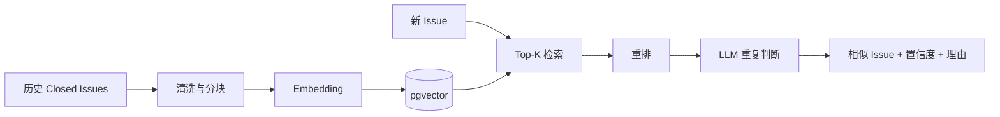

计划包括：

- [ ] 采集历史 Closed Issues
- [ ] 文本清洗
- [ ] Embedding
- [ ] pgvector 索引
- [ ] 关键词召回
- [ ] 向量召回
- [ ] 混合检索
- [ ] Top-K 重排
- [ ] 重复判断
- [ ] 相似 Issue 链接和理由
- [ ] Recall@K / MRR 评估

### 第五阶段：Agent 扩展

- [ ] LangGraph Postgres Checkpointer
- [ ] `interrupt()` 人工中断与恢复
- [ ] MCP Server
- [ ] 暴露审核查询 Tool
- [ ] 暴露 approve / reject Tool
- [ ] 简单 Web 审核界面

---

## 项目定位

IssueFlow 当前属于工作流型 Agent。

主要执行路径由代码预先定义：

```text
triage
→ risk route
→ draft / security review
→ command proposal
→ human review
→ command execution
```

模型负责：

- 理解 Issue；
- 生成结构化分类；
- 判断风险；
- 生成摘要；
- 生成回复；
- 提出标签和评论草案。

工程系统负责：

- Webhook 接入；
- 验签；
- 去重；
- 事务；
- 异步队列；
- 状态持久化；
- 权限控制；
- 人工审核；
- 外部 API 调用；
- 错误记录。

项目目标不是构造一个不受控制的通用智能体，而是实现一条真实、可审核、可追踪的 GitHub Issue 自动化处理流程。

---

## 参考资料

- [GitHub：Validating webhook deliveries](https://docs.github.com/en/webhooks/using-webhooks/validating-webhook-deliveries)
- [GitHub：Webhook events and payloads](https://docs.github.com/en/webhooks/webhook-events-and-payloads)
- [GitHub REST API：Issue labels](https://docs.github.com/en/rest/issues/labels)
- [GitHub REST API：Issue comments](https://docs.github.com/en/rest/issues/comments)
- [LangGraph Overview](https://docs.langchain.com/oss/python/langgraph/overview)
- [LangGraph Workflows and Agents](https://docs.langchain.com/oss/python/langgraph/workflows-agents)
- [RQ Documentation](https://python-rq.org/docs/)
- [Smee](https://smee.io/)
