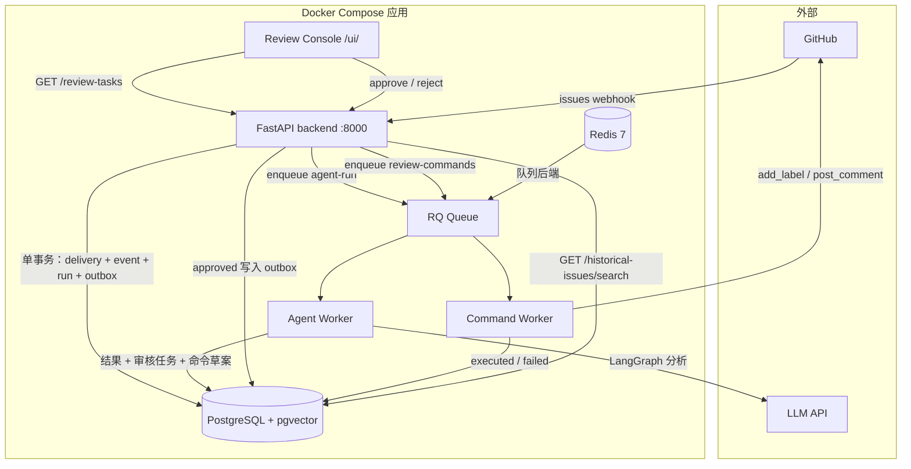
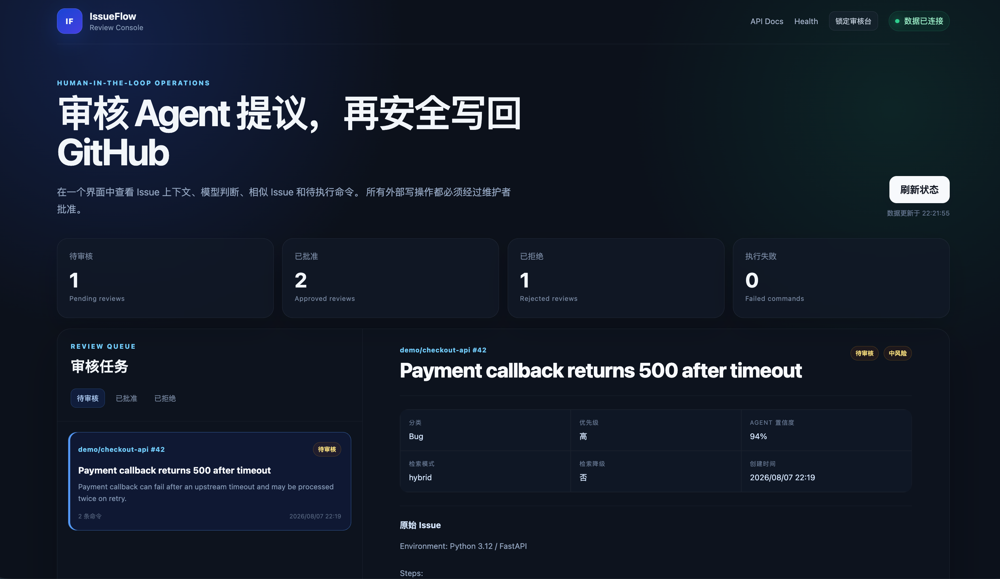
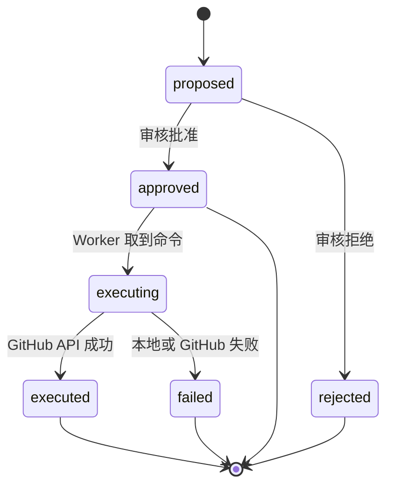
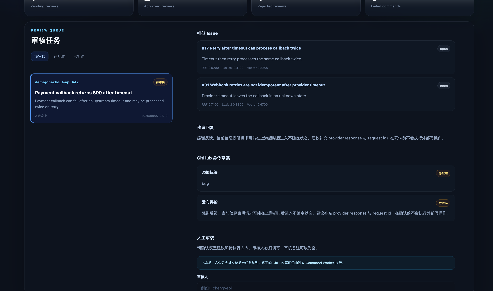
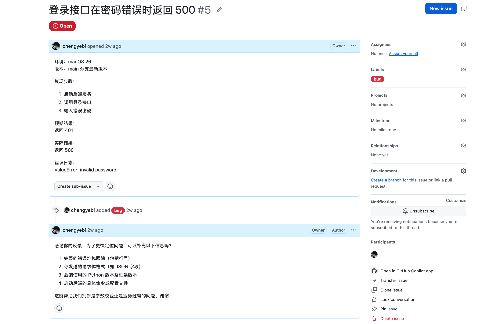

# IssueFlow Agent

[](https://github.com/chengyebi/issueflow-agent/actions/workflows/ci.yml)

面向 GitHub 仓库维护场景的 Issue 智能分诊与人工审核系统。

IssueFlow 通过 GitHub Webhook 接收 Issue 事件，用 LangGraph 编排大模型分析流程，生成分类、风险判断、缺失复现信息检查和标签/回复草案，再从历史 Issue 中检索相似问题辅助查重。模型不会直接修改 GitHub：所有外部写操作都必须先进入人工审核，批准后才由后台 Worker 异步执行。

This project focuses on controlled automation: **the model proposes, the system constrains, and a human approves side effects.**

- 项目类型：工作流型 Agent（LangGraph workflow），非无约束通用 Agent
- 核心原则：模型负责提出建议，程序负责约束流程，人工负责批准外部操作
- 评估状态：Retrieval Evaluation 已按冻结协议在 held-out TEST 集上完成，报告与数据集均在 `eval/` 保留

## Evaluation Snapshot

历史 Issue 查重检索在 **maintainer-derived positive duplicate-relation retrieval benchmark** 上按冻结协议评测：

- 语料快照 **6485** 条已入库历史 Issue；真值仅来自维护者明确操作，共 **164** 条 duplicate-relation qrels（DEV **74** / TEST **90**），按 **147** 个 Duplicate Cluster 完全隔离；
- **frozen primary（TEST 前冻结）= `vector_chunked`**，TEST macro：Recall@5=**0.6835**、MRR@10=**0.6009**、nDCG@10=**0.6269**；
- `vector_head512` 的 TEST macro nDCG point estimate **0.6353** 小幅高于 frozen primary，但 TEST 不用于回选方法。

完整五方法对比表见 [检索评测](#检索评测)。

---

## 目录

- [Evaluation Snapshot](#evaluation-snapshot)
- [为什么需要 IssueFlow](#为什么需要-issueflow)
- [核心设计](#核心设计)
- [系统总览](#系统总览)
- [事件接入与事务一致性](#事件接入与事务一致性)
- [Agent 工作流](#agent-工作流)
- [人工审核与 GitHub 写回](#人工审核与-github-写回)
- [历史 Issue 检索](#历史-issue-检索)
- [检索评测](#检索评测)
- [可观测性](#可观测性)
- [安全与可靠性](#安全与可靠性)
- [API 一览](#api-一览)
- [技术栈](#技术栈)
- [项目结构](#项目结构)
- [快速开始](#快速开始)
- [配置 GitHub Webhook](#配置-github-webhook)
- [使用方式](#使用方式)
- [验证路径](#验证路径)
- [当前边界](#当前边界)
- [Roadmap](#roadmap)
- [文档与评估产物](#文档与评估产物)

---

## 为什么需要 IssueFlow

GitHub 仓库的 Issue 维护通常是重复且耗时的：判断类型、评估优先级、核对复现信息、回复提问、打标签、排查是否已有重复 Issue。

直接让大模型修改 GitHub 有明显风险：

- 模型输出不确定，可能生成错误标签或不合适的公开回复；
- Issue 正文属于外部不可信输入，不能当作可执行指令；
- 安全漏洞不适合自动公开处理；
- 外部 API 调用需要权限、状态与失败记录。

IssueFlow 把整个过程拆成一条受约束的流水线，而不是把钥匙直接交给模型：

```text
事件接入
→ 验签 / 去重 / 事务入库
→ 后台 Agent 分析
→ 生成命令草案
→ 人工审核
→ Worker 异步写回 GitHub
→ 保存执行结果
```

## 核心设计

| 原则 | 含义 |
|---|---|
| 模型提出建议 | 模型只生成结构化分析结果和命令草案 |
| 程序限定能力 | 命令白名单只允许 `add_label` 与 `post_comment`；Pydantic 强制输出 Schema |
| 人工批准外部写 | 任何 GitHub 写操作都必须先通过 Review Console 审核 |
| PostgreSQL 是事实来源 | 状态与错误保存在数据库，Redis 只做任务队列 |
| 可追踪 | 每条 Agent 运行记录节点级 Trace、Token 与估算成本 |

模型不能：关闭 Issue、删除评论、修改代码、创建 PR、执行 Issue 文本中的脚本、绕过人工审核调用 GitHub。

## 系统总览


```mermaid
flowchart TB
    subgraph Ext["外部"]
        GH["GitHub"]
        LLM["LLM API"]
    end

    subgraph App["Docker Compose 应用"]
        API["FastAPI backend :8000"]
        PG[("PostgreSQL + pgvector")]
        RD[("Redis 7")]
        Q["RQ Queue"]
        AW["Agent Worker"]
        CW["Command Worker"]
        UI["Review Console /ui/"]
    end

    GH -->|"issues webhook"| API
    API -->|"单事务：delivery + event + run + outbox"| PG
    API -->|"enqueue agent-run"| Q
    Q --> AW
    AW -->|"LangGraph 分析"| LLM
    AW -->|"结果 + 审核任务 + 命令草案"| PG
    UI -->|"GET /review-tasks"| API
    UI -->|"approve / reject"| API
    API -->|"approved 写入 outbox"| PG
    API -->|"enqueue review-commands"| Q
    Q --> CW
    CW -->|"add_label / post_comment"| GH
    CW -->|"executed / failed"| PG
    API -->|"GET /historical-issues/search"| PG
    RD -->|"队列后端"| Q
```

| 组件 | 职责 |
|---|---|
| FastAPI backend | 接收 Webhook、提供审核/检索/观测 API、静态托管 Review Console |
| PostgreSQL | 业务事实、审核状态、命令、检索向量（pgvector）与 Trace |
| Redis + RQ | 任务队列；Agent 与 Command Worker 从中取任务 |
| Agent Worker | 执行 LangGraph 分析流程，调用 LLM 生成结构化结果 |
| Command Worker | 执行批准后的 GitHub 写操作（加标签、发评论） |
| Review Console | 只读展示 + 决策操作，页面需管理员 Token 解锁 |
| LLM API | 通过 OpenAI-compatible 接口配置，默认 DeepSeek |

## 事件接入与事务一致性

Webhook 端只做三件事：验签、去重、入库后尽快返回。分析等耗时工作交给 Worker 异步执行，避免外部服务失败拖垮入口请求。

支持 GitHub `issues` 事件，action 白名单为 `opened` / `edited` / `closed` / `reopened`。Pull Request 事件只记录 Delivery 后忽略。签名使用 `X-Hub-Signature-256` HMAC-SHA256 校验；`X-GitHub-Delivery` 唯一约束防止重复入库。

### 单事务交付

收到事件后，后端在**一个数据库事务**里完成：

```text
INSERT webhook_deliveries (delivery_id 幂等)
INSERT issue_events
INSERT agent_runs
INSERT outbox_events (event_type = 'agent_run')
必要时 INSERT outbox_events (event_type = 'issue_index')
```

事务提交后再投递 RQ。投递失败时 Outbox 记录保持 `pending`，由扫描任务按指数退避重试，因此数据库中的任务不会因为 Redis 短时不可用而丢失。这套机制提供**至少一次投递**和本地幂等，不等于跨系统 exactly-once。

Outbox 事件类型：`agent_run`（触发 Agent 分析）、`review_commands`（审核批准后执行命令）、`issue_index`（后台索引历史 Issue）。

## Agent 工作流

Agent 是代码预先定义路径的工作流型 Agent，节点由 LangGraph `StateGraph` 编排：

```text
triage_issue（分类 / 优先级 / 风险 / 置信度）
→ 风险路由（risk_level == high?）
→ draft_review（复现信息检查 / 摘要 / 建议回复）
   或 security_review（高风险：只给安全提示，不生成公开动作）
→ prepare_actions（生成标签与评论草案）
```

分类结果：`bug` / `feature` / `question` / `documentation` / `other`。标签映射为 `bug`、`enhancement`、`question`、`documentation`；`other` 不自动打标签（“无法归类”不等于“无效 Issue”）。

高风险分支（漏洞利用、认证绕过、密钥泄露、隐私数据、危险执行）只产出 `NEEDS_SECURITY_REVIEW`，不生成任何公开标签或评论命令，交由维护者人工处理。

## 人工审核与 GitHub 写回

### Review Console（/ui/）

后端托管一个静态审核界面 `/ui/`（原生 HTML/CSS/JS，非前端框架）：

- 按 `pending` / `approved` / `rejected` 分组展示审核任务；
- 详情页展示原始 Issue、Agent 摘要、缺失复现信息、重复判断、相似 Issue、建议回复和命令草案；
- 审核人必须填写，备注可选；批准/拒绝前有确认弹窗；
- 审核台默认锁定：需输入 `REVIEW_ADMIN_TOKEN` 解锁，Token 仅保存在当前浏览器页面会话（`sessionStorage`），不进入 URL；可随时点击“锁定审核台”清除；
- 页面启用 CSP（`default-src 'self'`）与 `no-referrer`；`401`（Token 无效）或 `503`（服务端未配置 Token）时自动重新锁定。



*Review Console — 本地合成演示。维护者在任何 GitHub 外部写操作发生前检查 Issue 上下文、Agent 判断与待执行动作。*

### 审核鉴权

审核 API 使用**最小共享管理员 Token**（`X-Review-Admin-Token` 请求头，`secrets.compare_digest` 比较），不是 RBAC / OAuth / IAM。未配置时返回 `503`，Token 不匹配返回 `401`。

### 决策语义


```mermaid
stateDiagram-v2
    [*] --> proposed
    proposed --> approved : 审核批准
    proposed --> rejected : 审核拒绝
    approved --> executing : Worker 取到命令
    executing --> executed : GitHub API 成功
    executing --> failed : 本地或 GitHub 失败
    approved --> [*]
    rejected --> [*]
    executed --> [*]
    failed --> [*]
```

批准流程：`review_tasks` 置为 `approved`、`github_commands` 置为 `approved`、写 `review_commands` Outbox，然后 Worker 依次执行命令。拒绝流程把仍处于 `proposed` 的命令置为 `rejected`，不进入执行队列。重复决定同一个任务返回 `409 Conflict`；并发决定由 `SELECT ... FOR UPDATE` 串行化。

### 崩溃语义（诚实边界）

- 已完成的 GitHub 写操作不自动重放：连接中断可能无法确认评论是否已创建，系统对这种情况的 HTTP 失败按 `retry_safe=false` 处理，避免静默发布重复评论；
- 外部成功但本地状态更新前崩溃的 `executing` 命令保留 `executing`，需要人工对账，不自动重放；
- GitHub 请求在失败前最多重试有限次数，并对 403/429 限流做专门识别；
- 恢复入口：`POST /recovery/outbox/dispatch`、`POST /recovery/agent-runs/{id}/requeue`、`POST /recovery/github-commands/{id}/requeue`（命令重入队要求已批准、`failed` 且 `retry_safe=true`）。恢复不会绕过审核状态和命令白名单。

## 历史 Issue 检索

### 链路与数据

历史 Issue 进入 `historical_issues`（按 `(repo, issue_number)` 幂等更新，内容哈希不变时不重复生成向量或 Chunk）。文本表示使用确定性规范化：Unicode NFKC、统一换行、空正文写为 `[empty]`、固定 `Title`/`Body` 字段顺序，表示版本记为 `issue-title-body-v2`。

```text
GitHub Backfill / Issue Webhook
→ Pull Request 过滤
→ repo + issue_number 幂等更新
→ content_hash 判断内容变化
→ lexical / vector 检索
→ RRF 融合 Top-K
→ LLM 结构化重复判断（仅审核建议）
```

### Embedding

Embedding 在 Docker CPU 内本地运行，不把 Issue 内容发送到外部 Embedding 服务：

- Provider：`fastembed`，模型 `BAAI/bge-small-en-v1.5`，384 维；
- 模型缓存位于持久化 Volume `fastembed_cache`（`/var/cache/issueflow/fastembed`）；缓存完成后可设 `EMBEDDING_LOCAL_FILES_ONLY=true` 禁止联网加载；
- 启动探针会实际生成向量并校验维度，不一致时终止启动，不写入数据库；
- Provider 取值：`fastembed`（本地 CPU）、`disabled`（禁用向量检索）、`fake`（仅测试/合成评测）、其他值明确失败，不会静默切换云端。

### 长文本策略

`bge-small-en-v1.5` 的输入上限为 512 tokens，系统有两种表示：

- **head512**：规范化标题+正文直接截到 512 tokens，同时记录原始/实际输入 token 数与 `truncated` 标记，不静默丢信息；
- **chunked**：用模型附带的真实 tokenizer 分块，默认每段 384 tokens、重叠 64、单 Issue 最多 16 段，每段重复标题；长查询也用同样策略拆成多个 Query Chunk 分别检索，再按 Issue 聚合。内容哈希与配置版本键不变时不重新分块或生成向量。

检索输入**只包含标题和正文**。标签、评论、`/duplicate of #N` 文本、维护者事后标记都明确排除在检索输入之外，避免把事后信息泄漏给查询。

### 三种检索模式

| 模式 | 机制 |
|---|---|
| `lexical` | PostgreSQL `pg_trgm` 相似度 + 全文检索（`websearch_to_tsquery`） |
| `vector` | pgvector cosine 距离（`head512` 或 `chunked`），HNSW 索引 |
| `hybrid` | 两路结果做 Reciprocal Rank Fusion（`rrf_k=60`） |

Embedding 未配置或失败时，`hybrid` 自动降级为 `lexical`，并在响应中标记 `degraded=true` 与原因。当前**未启用** cross-encoder 重排器（`DUPLICATE_RERANKER_ENABLED=false`）。

查询 API：

```text
GET /historical-issues/search?repo=owner/repo&query=login%20timeout&mode=hybrid&top_k=5
```



*Review detail — local synthetic demo. Retrieved historical Issues remain review evidence; the Agent only proposes constrained `add_label` / `post_comment` commands.*

## 检索评测

### 数据集与协议

正式评测是 **maintainer-derived positive duplicate-relation retrieval benchmark**（检索召回/排序评估），不是完整“查重分类准确率”。评估仓库为 `microsoft/vscode`、`nodejs/node`、`rust-lang/rust`；正样本仅来自维护者明确操作（effective duplicate 事件或维护者身份写出的 duplicate comment）。

- DEV 集 **74** 条查询，TEST 集 **90** 条查询，合计 **164** 条（两者完全隔离）；
- 真值按无向 **Duplicate Cluster** 组织，共 **147** 个 cluster；同一 Issue / 同一 Cluster 不跨 DEV/TEST；
- 候选语料：同仓库、不是查询自身、且 `candidate.github_created_at < query_created_at`；
- 快照记录候选语料共 **6485** 条已入库 Issue（vscode 2236 / node 2126 / rust 2123），见 `repository_snapshots.json`；
- 指标：Recall@1/5/10、MRR@10、nDCG@10、延迟 P50/P95，按仓库单独计算后取仓库 Macro；置信区间用固定种子的 Query 级 Bootstrap（2000 次）。

### 冻结流程

参数与主方法在 TEST 前由 DEV 冻结，TEST 只运行一次且不参与任何参数重选：

1. DEV 比较 Query Prefix（无前缀 vs `Represent this sentence for searching relevant passages: `）与 Chunk 聚合（`max_chunk_score` vs `mean_top2_chunk_score`），按 Macro nDCG@10 选择，tie-break 倾向无前缀 / `max_chunk_score`；
2. 冻结配置写入 `eval/reports/rag_frozen_config.json`；
3. 预声明 primary retrieval method 写入 `eval/reports/rag_primary_method.json`；
4. 在 held-out TEST 上运行一次，结果冻结于 `eval/reports/rag_test.json`。

### TEST 结果（macro，90 条查询）

| 方法 | Recall@1 | Recall@5 | Recall@10 | MRR@10 | nDCG@10 |
|---|---|---|---|---|---|
| lexical | 0.2197 | 0.3442 | 0.3811 | 0.3009 | 0.3147 |
| vector_head512 | 0.4924 | 0.6723 | 0.7234 | 0.6151 | **0.6353** |
| **vector_chunked（冻结主方法）** | 0.4816 | **0.6835** | 0.7231 | **0.6009** | **0.6269** |
| hybrid_head512_rrf | 0.3634 | 0.6129 | 0.7313 | 0.5072 | 0.5534 |
| hybrid_chunked_rrf | 0.3511 | 0.6408 | 0.7393 | 0.5123 | 0.5620 |

**frozen primary 是 `vector_chunked`**：Macro Recall@5=0.6835、MRR@10=0.6009、nDCG@10=0.6269。它是在 DEV 上按预声明规则选出的主方法，并在 TEST 前冻结。

TEST 上的最高 macro nDCG@10 point estimate 是 `vector_head512`（0.6353），但它**不是**冻结主方法，也没有被用来重新选择配置。冻结的 primary `vector_chunked` 为 0.6269，point-estimate gap = 0.0084。

两种方法各自的 Bootstrap 95% CI 高度重叠：`vector_head512` [0.5464, 0.7172]、`vector_chunked` [0.5406, 0.7123]。但这些都是各方法自身的**边际 CI**；项目未执行 paired-delta significance test，因此**不对 0.0084 的差异作统计显著性声明**，也不进一步推导 significant / not significant / noise。

HNSW 相对 Exact 的 Top-K 召回率与顺序一致率均为 1.0（当前语料规模下 HNSW 相对 Exact 无召回损失，延迟也未明显降低，如实保留）。

### 从结果中学到什么

1. **Chunk 不是普遍更优**：`vector_chunked` 在 DEV 胜出被冻结为主方法，但 TEST 上 nDCG@10（0.6269）低于 `vector_head512`（0.6353）。长文本分块对召回有帮助，但对整体排序并非稳定占优。
2. **召回与排序是两回事**：`vector_chunked` 的 Recall@5（0.6835）略高于 `head512`（0.6723），但 nDCG 反而更低——长尾召回提升没有自动转成更好的排序质量。
3. **RRF Hybrid 是一个“扩大覆盖、削弱顶部排序”的 trade-off**：冻结配置下，`hybrid_chunked_rrf` 的 macro Recall@10 为 0.7393，高于 `vector_chunked` 的 0.7231——RRF 把 lexical 分路的候选带进较深位置，扩大了候选覆盖；但其 macro nDCG@10 为 0.5620，低于 `vector_chunked` 的 0.6269，说明当前 RRF fusion 在扩大覆盖的同时削弱了顶部排序质量。
4. **鲁棒性 bug 值得修**：极长或含长 `-` 连串的查询曾让 `websearch_to_tsquery` 解析栈溢出（`tsquery stack too small`）。通过把 tsquery 输入截断到 2000 字符并折叠 `-` 连串修复，并补充了回归测试。

完整的协议、泄漏边界与长文本策略见 [文档与评估产物](#文档与评估产物)。

## 可观测性

观测基于 PostgreSQL 持久化，不引入 OpenTelemetry / Prometheus / Grafana：

- `GET /traces`：Agent 运行列表（状态、模型、Prompt 版本、耗时、Token、估算成本）；
- `GET /traces/{trace_id}`：单条运行的节点级 Trace（每节点输入/输出摘要、耗时、Token、错误）；
- `GET /metrics/agent-runs`：聚合指标（完成/失败数、结构化输出成功率、平均 Token 与估算成本、耗时 P50/P95）。

## 安全与可靠性

| 风险 | 当前措施 |
|---|---|
| 伪造 Webhook | HMAC-SHA256 验签 |
| Webhook 重放 | `X-GitHub-Delivery` 唯一约束 |
| 非目标事件触发 | `event_name` / `action` 白名单，PR 事件忽略 |
| Prompt Injection | 固定 System Prompt，Issue 文本只作为数据 |
| 模型自由输出 | Pydantic 结构化输出 + 命令类型白名单 |
| 未审核自动写入 | Human-in-the-loop；`GITHUB_WRITE_ENABLED=false` 为 Compose 默认 |
| 高风险内容公开 | 高风险分支不生成公开命令 |
| Token 权限过大 | Fine-grained PAT，仅授权指定仓库 Issues 写权限 |
| 重复审核 / 重复命令 | `SELECT FOR UPDATE` + 唯一 `idempotency_key` |
| 任务丢失 | Outbox + 指数退避（基础 5s）+ 恢复接口 |
| 外部写重复 | 崩溃窗口下的重复评论不自动重放，保留 `executing` 待人工对账 |

## API 一览

| 方法 | 路径 | 说明 |
|---|---|---|
| `GET` | `/health` `/health/embedding` | 健康与 Embedding 探针 |
| `POST` | `/webhooks/github` | 接收真实 GitHub Webhook |
| `POST` | `/agent/analyze` | 直接调用 Agent 分析（调试用） |
| `GET` | `/events` | 查询最近的 Issue 事件 |
| `GET` | `/review-tasks?status=pending` | 查询审核任务（需审核 Token） |
| `POST` | `/review-tasks/{id}/approve` | 批准并派发命令（需审核 Token） |
| `POST` | `/review-tasks/{id}/reject` | 拒绝并取消待批准命令（需审核 Token） |
| `GET` | `/historical-issues/search` | 历史 Issue 检索 |
| `GET` | `/traces` `/traces/{trace_id}` | Agent 运行与节点级 Trace |
| `GET` | `/metrics/agent-runs` | 聚合运行指标 |
| `POST` | `/recovery/outbox/dispatch` 等 | 恢复入口 |
| `GET` | `/docs` | OpenAPI 文档 |

## 技术栈

| 类型 | 技术 |
|---|---|
| 语言 / 后端 | Python 3.12、FastAPI、Uvicorn |
| Agent 编排 | LangGraph（workflow 模式） |
| 模型调用 | OpenAI-compatible API（默认 DeepSeek） |
| 数据校验 | Pydantic |
| 数据库 | PostgreSQL + pgvector、pg_trgm / 全文检索、Psycopg |
| 迁移 | Alembic |
| 队列 | Redis 7、RQ |
| 检索 | FastEmbed、`BAAI/bge-small-en-v1.5`（384 维）、RRF |
| 外部集成 | GitHub Webhook、GitHub REST API |
| 容器化 | Docker、Docker Compose |
| 本地 Webhook 转发 | Smee |

## 项目结构

```text
issueflow-agent/
├── backend/
│   ├── Dockerfile
│   ├── requirements.txt / requirements-dev.txt
│   ├── alembic.ini
│   ├── migrations/          # Alembic 迁移（versions/0001..0005）
│   └── app/
│       ├── main.py          # FastAPI 入口，挂载路由与 /ui/
│       ├── api/             # webhooks / issues / agent / reviews / rag / observability / recovery / evals / health
│       ├── agents/          # LangGraph 工作流与结构化 Schema
│       ├── rag/             # embedding / chunking / indexing / retrieval / repository / sync / schema
│       ├── services/        # events / outbox / reviews / github / traces / evals
│       ├── workers/         # RQ worker（agent / command / recovery / index）
│       ├── ui/              # Review Console（index.html / app.js / styles.css）
│       ├── core/            # 配置、审核鉴权
│       ├── db/              # 数据库连接
│       └── models/          # 领域模型
├── docs/                    # rag.md、reliability.md、评测方法、泄漏边界、长文本策略 等
├── eval/
│   ├── datasets/            # qrels（dev/test）、clusters、snapshots、示例数据
│   └── reports/             # rag_baseline_dev / rag_dev / rag_frozen_config / rag_primary_method / rag_test
├── scripts/                 # 检索评测 / 语料索引 / 真值采集 等 CLI
├── database/init/           # 基础 Schema 初始化 SQL（initdb）
├── docker-compose.yml
├── .env.example
└── README.md
```

## 快速开始

### 1. 环境要求

Docker、Docker Compose、Git、一个 GitHub 测试仓库、GitHub PAT 与可用的大模型 API。

### 2. 配置环境变量

```bash
cp .env.example .env
```

编辑 `.env` 填写 `GITHUB_WEBHOOK_SECRET`、`LLM_API_KEY`、`GITHUB_TOKEN`，并按需设置 `REVIEW_ADMIN_TOKEN`。`.env` 已被 `.gitignore` 忽略。

Compose 默认 `GITHUB_WRITE_ENABLED=false`，即未显式开启前，系统不会发出任何 GitHub 写请求。

### 3. 启动服务

```bash
docker compose up -d --build
```

`docker-compose.yml` 中的 `migrate` 服务会先执行 `alembic upgrade head` 完成迁移，之后后端与 Worker 才启动。启动后可通过 `/health` 与 `/health/embedding` 探针确认 Embedding 正常（不一致时后端拒绝启动）。

### 4. 健康检查

```bash
curl --noproxy '*' http://127.0.0.1:8000/health
```

### 5. 查看 Worker 日志

```bash
docker compose logs -f worker
```

## 配置 GitHub Webhook

本地开发用 Smee 把 GitHub 事件转发到本地后端：

```bash
npm install -g smee-client
smee -u https://smee.io/<YOUR_CHANNEL_ID> -t http://127.0.0.1:8000/webhooks/github
```

在测试仓库 `Settings → Webhooks → Add webhook` 中填写 Smee 的 Payload URL、`Content type: application/json`、`Secret`（与 `GITHUB_WEBHOOK_SECRET` 相同），Events 只勾选 `Issues`。

## 使用方式

### 查询待审核任务

```bash
curl --noproxy '*' \
  'http://127.0.0.1:8000/review-tasks?status=pending' \
  -H 'X-Review-Admin-Token: <REVIEW_ADMIN_TOKEN>'
```

### 批准任务

```bash
curl --noproxy '*' \
  -X POST 'http://127.0.0.1:8000/review-tasks/<REVIEW_TASK_ID>/approve' \
  -H 'Content-Type: application/json' \
  -H 'X-Review-Admin-Token: <REVIEW_ADMIN_TOKEN>' \
  -d '{"reviewer": "cy", "review_note": "确认 Agent 分析结果"}'
```

批准后命令进入 `review_commands` Outbox，由 Command Worker 执行并写回 GitHub。

### 拒绝任务

```bash
curl --noproxy '*' \
  -X POST 'http://127.0.0.1:8000/review-tasks/<REVIEW_TASK_ID>/reject' \
  -H 'Content-Type: application/json' \
  -H 'X-Review-Admin-Token: <REVIEW_ADMIN_TOKEN>' \
  -d '{"reviewer": "cy", "review_note": "分析结果不合适"}'
```

拒绝后仍处于 `proposed` 的命令被取消，不会进入执行队列。

### 历史 Issue 检索

```bash
curl --noproxy '*' \
  'http://127.0.0.1:8000/historical-issues/search?repo=owner/repo&query=login%20timeout&mode=hybrid&top_k=5'
```

## 验证路径

项目曾用自身仓库作为测试仓库，在真实 GitHub Issue 上跑通完整链路：创建 Issue → Webhook 到达 → Agent 判定并生成标签/评论草案 → 人工批准 → Worker 添加标签并发布评论 → 命令状态变为 `executed`。一次真实的端到端写回发生在 [GitHub Issue #5](https://github.com/chengyebi/issueflow-agent/issues/5)：人工批准后，IssueFlow 为它添加 `bug` 标签，并发布批准后的补充信息评论。



*真实端到端写回演示：人工批准后，IssueFlow 为 GitHub Issue #5 添加 `bug` 标签，并发布批准后的补充信息评论。*

检索与评测的验证则以冻结的 DEV/TEST 数据集为准（见 [检索评测](#检索评测)），不使用合成样例冒充真实效果。

## 当前边界

- 审核鉴权是最小共享管理员 Token，不是 RBAC / OAuth / IAM，也不区分多用户角色；
- 崩溃窗口下 GitHub 写操作不能保证 exactly-once，重复评论不自动重放，依赖人工对账；
- 检索评测是 Retrieval Evaluation，**不宣称**查重分类准确率、Precision、F1 或 Agent 端到端准确率；
- 未启用 cross-encoder 重排器；RAG 不发送 Issue 内容到外部 Embedding 服务；
- 观测体系基于 PostgreSQL 持久化，未接入 OpenTelemetry / Prometheus / Grafana；
- 未配置确认的模型单价时，成本指标保持 `null`；
- 当前是工作流型 Agent（LangGraph workflow），不是多智能体，也没有 MCP / Kubernetes / Kafka 等设施；
- 可对外引用的 Agent 指标需要独立人工标注集与 `--allow-external` 实测，README 不虚构生产流量、QPS、uptime 或 SLA。

## Roadmap

- 一键 Smoke Test 与更完整的 Webhook / 审核回归用例，让新环境可复现验证；
- 长文本与检索的进一步分析：在更长 Issue 上的 Chunk 配置、以及 Hybrid 排序质量为何低于纯 Vector 的归因；
- 补全崩溃窗口下的外部状态对账与人工对账工具；
- 明确模型单价配置，使成本指标从 `null` 变为可解释的估算；
- 评估更细粒度的 Agent 指标（结构化输出成功率、延迟分布）并沉淀为可对外引用的报告。

## 文档与评估产物

- [历史 Issue 混合检索与查重](docs/rag.md)
- [查重检索评测方法](docs/rag-evaluation-methodology.md)
- [查重评测的数据泄漏边界](docs/rag-data-leakage.md)
- [长文本 Issue 检索策略](docs/rag-long-document-strategy.md)
- [任务投递与恢复](docs/reliability.md)
- [检索评测报告与数据集说明](eval/README.md)
- 评估产物：`eval/reports/rag_baseline_dev.json`、`eval/reports/rag_dev.json`、`eval/reports/rag_frozen_config.json`、`eval/reports/rag_primary_method.json`、`eval/reports/rag_test.json`
- 数据集：`eval/datasets/duplicate_qrels_dev.jsonl`、`eval/datasets/duplicate_qrels_test.jsonl`、`eval/datasets/duplicate_clusters.json`、`eval/datasets/repository_snapshots.json`
