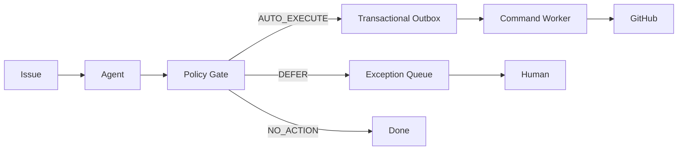

# Selective Automation V2

IssueFlow 将旧的 review-all 路径重构为由确定性 Policy Gate 控制的选择性自动化。

## Architecture



核心约束：

- LLM 只产生结构化分析与 proposed actions
- Policy Gate 是确定性代码，不再次调用 LLM
- GitHub 写操作始终经过 authorization、whitelist、Outbox 与 Worker
- 高风险或未校准动作 fail-closed 到人工接管

## Policy Gate

`backend/app/automation/policy.py` 按以下顺序评估：

1. high-risk → DEFER
2. retrieval degraded → DEFER
3. `duplicate_assessment.is_duplicate == true` → DEFER
4. 已知 semantic category 但目标 repo 没有已验证 label mapping → DEFER (`UNSUPPORTED_ACTION`)
5. no proposed actions → NO_ACTION
6. enforce 缺少有效 frozen policy → DEFER
7. 逐 action 检查 enabled / threshold / evidence
8. 全部 proposed actions 都通过 → AUTO_EXECUTE

当前 frozen policy 为：

`eval/automation/policy.label.frozen.json`

其中仅 `add_category_label` 允许自动执行，threshold=0.92。

## Authorization model

`github_commands.authorization_source` 区分两条合法路径：

| source | review_task_id | requirement |
|---|---|---|
| `policy` | `NULL` | valid `policy_version` |
| `human` | non-null | linked review is approved |

Command Worker 在执行前通过 `is_command_authorized()` 再次校验。系统不会为了自动执行伪造
`reviewer="system"` 的人工审核记录。

## Rollout modes

- `off`: 所有外部动作回到人工路径
- `shadow`: 记录 Policy Gate 的 would-auto / would-defer / would-no-action，但真实动作仍人工审核
- `enforce`: AUTO_EXECUTE 真实写回；DEFER 进入 Exception Queue；NO_ACTION 结束

Compose 默认 `AUTOMATION_MODE=shadow`，Worker 默认
`GITHUB_WRITE_ENABLED=false`。

## Issue-level all-or-nothing

当前路由采用 **Issue-level all-or-nothing**：

- 每个 proposed action 都必须通过 frozen policy
- 任一 action 不满足策略，整个 Issue DEFER
- 不执行“同一 Issue 一部分动作自动、一部分动作人工”的拆分写回

这是当前明确的生产边界。未来若引入更细粒度授权，需要单独设计状态机、幂等与评测协议，
不能直接从现有 label calibration 推导。

## Missing-information actions

`draft_review` 使用 category-aware completeness 判断：

- Bug 关注真正阻碍定位/复现的环境、版本、步骤与日志
- Feature 关注动机、目标、预期行为与验收标准
- Documentation / Question / Other 按各自必要上下文判断

只有 `needs_clarification=true` 且存在真正阻塞处理的最小缺失字段时，
`prepare_actions` 才生成 `request_missing_information`。该 intent 当前未获得自动执行 calibration，
因此会使整个 Issue DEFER。

## Outbox and dispatch

AUTO_EXECUTE 路径：

```text
save_completed_run_and_route()
→ transaction commits policy command + github_commands outbox
→ Agent Worker dispatch_event(outbox_event_key)
→ RQ
→ Command Worker
```

人工批准路径：

```text
review approval transaction
→ review_commands outbox
→ API dispatch_event(outbox_event_key)
→ RQ
→ Command Worker
```

数据库保存任务事实；Redis/RQ 只承担任务传递。

## Evaluation

自动标签 calibration 使用真实维护者标签、DEV-only threshold selection 与唯一一次 held-out TEST。

- TEST records: 506
- auto label actions: 198
- precision: 93.94%
- Wilson 95% CI: [89.71%, 96.50%]
- coverage: 39.13%
- threshold: 0.92

详见：

- [Label Automation Evaluation](../eval/automation/README.md)
- [Final Evaluation](../eval/automation/FINAL-LABEL-AUTOMATION-REPORT.md)

## Current boundaries

- duplicate decision 不自动执行
- high-risk Issue 不产生自动公开 side effect
- 未独立校准的 intent 不获得 policy authorization
- production 默认仍是 shadow
- controlled E2E 已验证 policy authorization → Outbox → RQ → GitHub 写回链路
