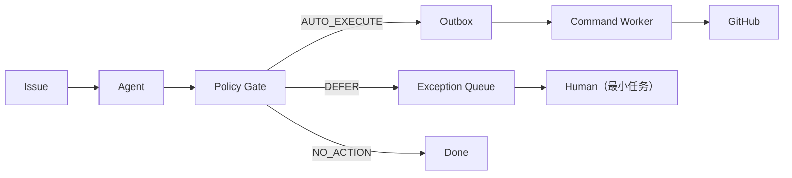

# Selective Automation V2

IssueFlow 从 review-all 转向**选择性自动化**的架构说明。

## 旧架构问题

- 每个 Agent Run 都强制创建 `review_tasks`，即使是低风险、可信的普通 Issue；
- `suggested_reply` 几乎总是被默认转成 `post_comment` 公开回复，产生大量“需要人工验证的公开技术回复”；
- 人工收到的核心信息是“AI 给了什么答案”，而不是“为什么这一条需要我”；
- 没有冻结的可靠性策略，`confidence` 与真实精度没有绑定，无法回答“哪些动作可以安全自动执行”。

## 新架构

- **自动处理是正常路径**：普通、低风险、满足冻结策略的动作自动执行；
- **人工接管是异常路径**：Agent 无法可靠处理的案例 DEFER，附最小化 Human Handoff。

## Policy Gate

`backend/app/automation/policy.py` 是**确定性代码**，不是“再问一次 LLM”。

决策顺序 fail-closed：

1. `risk_level == high` → DEFER（SECURITY_RISK）
2. `retrieval_degraded` → DEFER（RETRIEVAL_DEGRADED）
3. `duplicate_assessment.is_duplicate` → DEFER（DUPLICATE_UNCERTAIN）
4. 无 `proposed_actions` → NO_ACTION
5. `enforce` 模式缺少冻结策略 → DEFER（POLICY_BLOCKED）
6. 逐动作检查冻结策略规则（enabled / min_model_confidence / require_evidence）
7. 全部通过 → AUTO_EXECUTE

阈值来自 calibration artifact（`eval/automation/policy.json`），**不写死在代码里**。raw LLM `confidence` 只是 signal，不是 production 可信度。

## 授权模型

`github_commands` 通过 `authorization_source` 区分两种合法授权：

| 来源 | review_task_id | 状态 | 必要条件 |
|---|---|---|---|
| `policy` | `NULL` | approved/failed | `policy_version` 非空 |
| `human` | 非空 | review approved + approved/failed | review 已批准 |

Command Worker（`process_github_command`）用 `is_command_authorized()` 校验，未授权一律跳过。

- **auto command**：`review_task_id = NULL`，`authorization_source = 'policy'`
- **human command**：`review_task_id != NULL`，`authorization_source = 'human'`

绝不为了自动执行创建一个 `reviewer="system"` 的假人工审核任务。

## Shadow / Enforce

- `off`：完全兼容旧 review-all，紧急回滚用；
- `shadow`：Policy Gate 正常计算并落库 `automation_decisions`（`shadow=true`），真实动作仍走人工，收集策略与人工结果的对照；
- `enforce`：AUTO_EXECUTE → Outbox → Worker → GitHub；DEFER → Exception Queue；NO_ACTION → 结束。缺少冻结策略时 fail-closed。

shadow 数据允许未来回答：“如果当时真的自动执行，这些 action 中有多少会被维护者接受？”（当前 Review API 支持 approve/reject，暂不记录逐 action 修改，见“当前限制”。）

## Human Handoff

每条 DEFER 卡片必须包含（禁止“AI 不确定，请人工审核”这类废话）：

- `reason_code`：`security_risk` / `retrieval_degraded` / `duplicate_uncertain` / `conflicting_evidence` / `insufficient_evidence` / `low_calibrated_confidence` / `unsupported_action` / `policy_blocked` / `out_of_distribution` / `model_failure`；
- `reason`：针对当前 Issue 的具体事实；
- `human_task`：最小、可执行的人工任务；
- `evidence`：相关证据；
- `already_checked`：Agent 已完成的工作。

**duplicate 示例**：

> reason：系统检索到疑似重复候选 #1234，但当前重复检索尚未达到自动执行所需的可靠性。
> human_task：只需确认当前 Issue 与 #1234 是否属于同一根因。
> evidence：候选标题 / 匹配证据 / 判断理由

## 数据模型（migration 0006）

新增 `automation_decisions`：

- `agent_run_id`（UNIQUE）、`disposition`（auto_execute/defer/no_action）、`policy_version`、`shadow`
- DEFER 时填 `reason_code` / `reason` / `human_task` / `evidence` / `already_checked`

`github_commands` 解耦：

- 新增 `agent_run_id`，从旧 review_task 关系回填
- `review_task_id` 改为可空
- 新增 `authorization_source`（CHECK human/policy）、`authorization_reason`、`policy_version`、`action_intent`、`action_confidence`、`rationale`、`evidence`
- 旧数据回填：有 review_task 的命令标记为 `human`

Outbox 事件新增 `github_commands`（按 `agent_run_id` 批量执行 policy 命令），旧 `review_commands` 保留兼容。

## 缺失信息模板

`backend/app/automation/handoff.py`：

- LLM 只结构化判断“缺什么”；
- 真正对外写出的请求补充信息由 `render_missing_information_comment()` 确定性生成；
- 减少 hallucination、token、审核成本与随机措辞。

## 安全边界

- Agent 没有直接 GitHub 写权限：始终经过 whitelist + idempotency + Outbox + Worker + retry/recovery；
- security-risk 永远 fail-closed，自动公开 side effect 为 0；
- enforce 缺少冻结策略时 fail-closed；
- 不为了提升 coverage 放宽阈值或伪造评测指标。

## 评测方法

见 [eval/automation/README.md](../eval/automation/README.md)。

- 工具链已完成（build/run/select policy threshold）；
- 从 historical_issues 的 maintainer labels 构建 category ground truth；
- DEV / unseen TEST 划分，TEST 在阈值冻结前不得查看；
- 默认 runner 是确定性启发式，不调用付费 LLM（避免烧 API）；
- **当前 calibration 尚未执行**：无真实样本数、无已发布 coverage/precision。

## 当前限制

- automation calibration 未完成 → 所有 intent 仍 `enabled=false`，默认 shadow；
- duplicate 自动执行关闭（Retriever 离线覆盖率不足）；
- Review API 记录 approve/reject，暂不记录逐 action 修改；
- 不做大规模付费 LLM benchmark。
